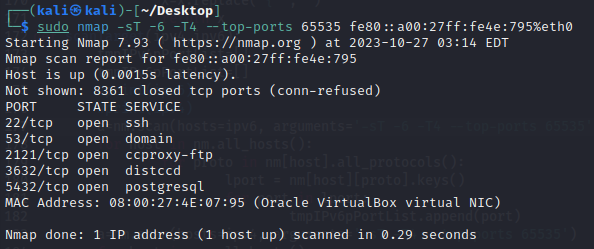
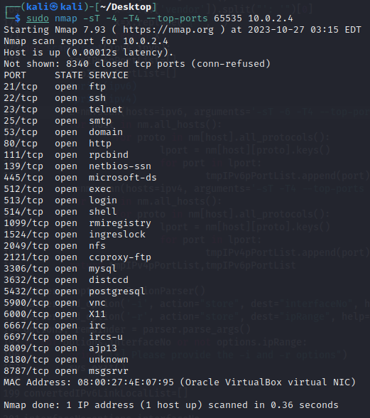

# ipv4bypass

Trustwave's John Anderson discussed how attackers can use IPv6 to bypass security protections due to security rules that apply to IPv4 but not IPv6.

You can access the article via the link below:

* [https://www.trustwave.com/en-us/resources/blogs/spiderlabs-blog/using-ipv6-to-bypass-security/](https://www.trustwave.com/en-us/resources/blogs/spiderlabs-blog/using-ipv6-to-bypass-security/)

## Dependences (tested on Kali Linux)

* nmap
* arp-scan
* python-nmap [(https://pypi.org/project/python-nmap/)](https://pypi.org/project/python-nmap/)
* termcolor [(https://pypi.org/project/termcolor/)](https://pypi.org/project/termcolor/)

## Installation of dependencies

* `pip install python-nmap`
* `pip install termcolor`
* `apt-get install arp-scan`

## Usage

* `python3 ipv4bypass.py -i eth0 -r 10.5.192.0/24`
* `python3 ipv4bypass.py -h`

## Screenshoot
* nmap ipv6 scan result
 

* nmap ipv4 scan result
 

* ipv4bypass.py scan result
 

